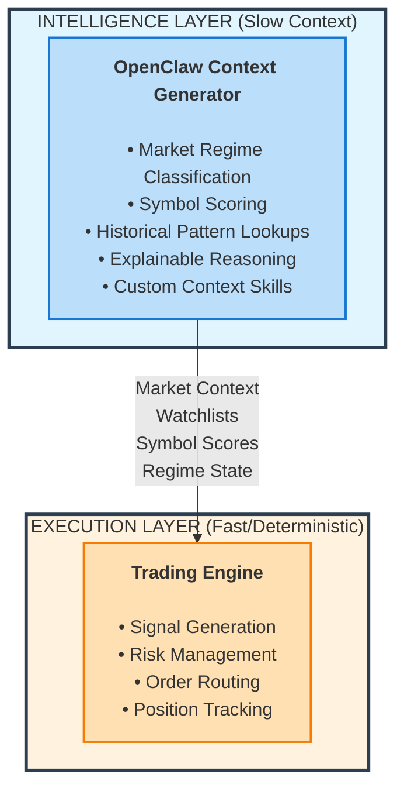
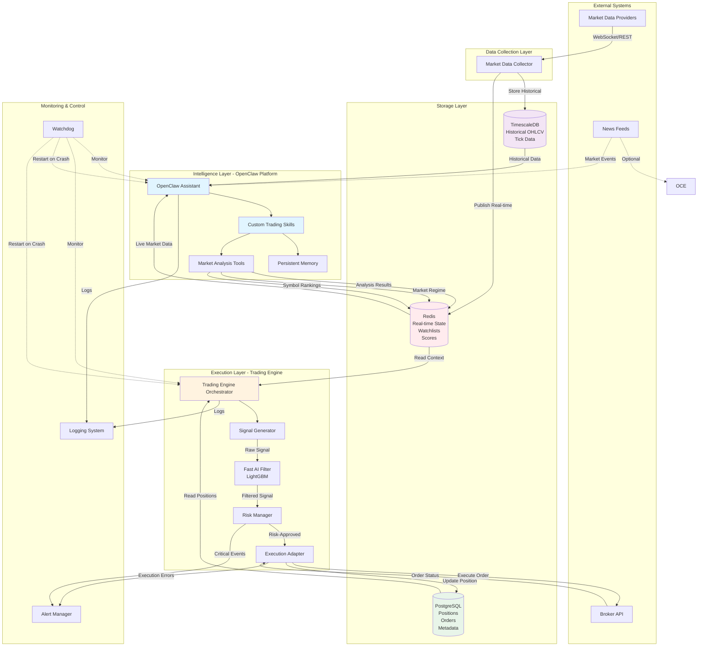
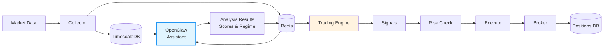
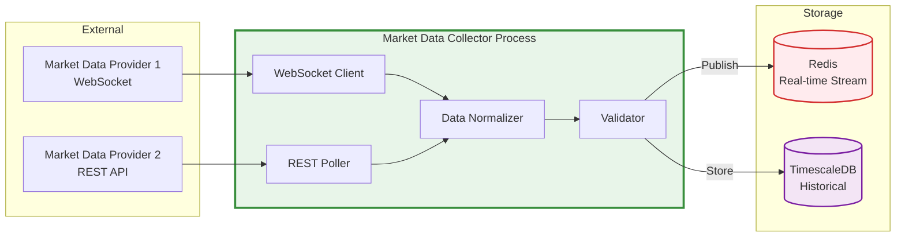
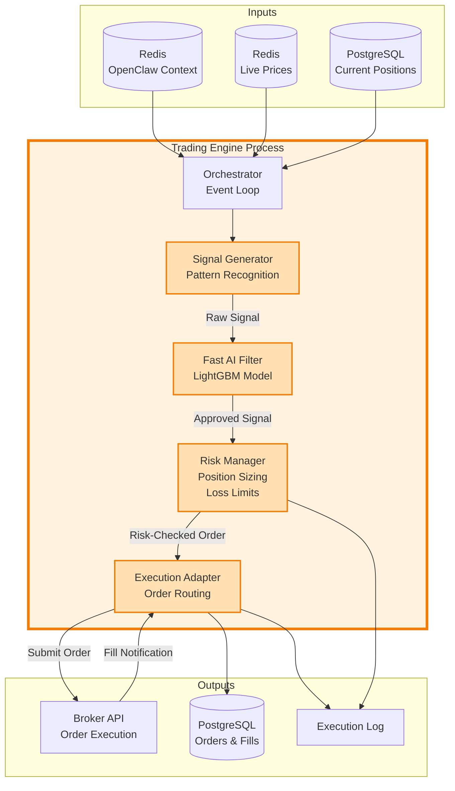
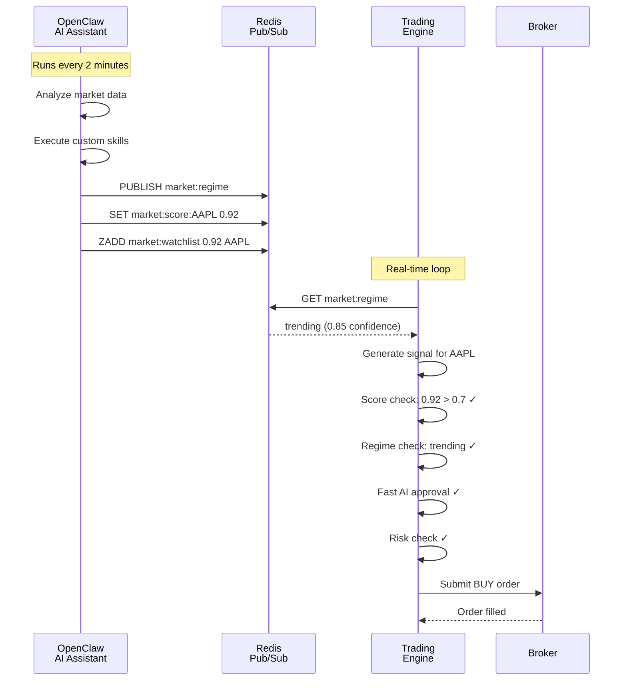
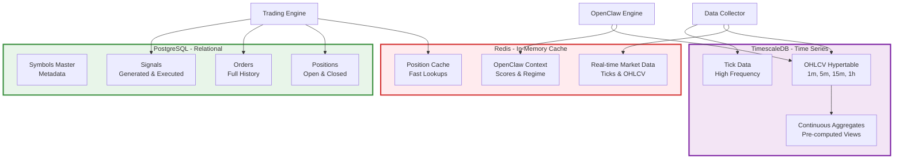
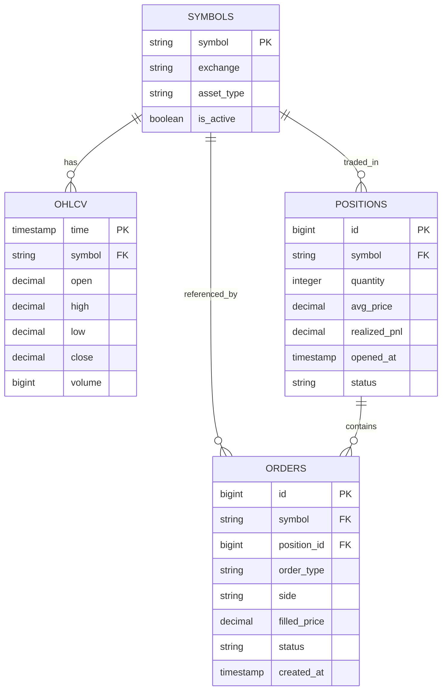

# Hybrid Intraday Trading System

**Architecture & Implementation Guide**

Version: 1.1 | Last Updated: March 11, 2026 | Status: Design Phase

---

## Table of Contents

1. **[Overview](#1-overview)** - System goals and architecture approach
2. **[System Architecture](#2-system-architecture)** - High-level design and components
3. **[Component Details](#3-component-details)** - Deep dive into each layer
4. **[Data Architecture](#4-data-architecture)** - Storage, schemas, and data flow
5. **[Technology Stack](#5-technology-stack)** - Languages, frameworks, and tools
6. **[Development Roadmap](#6-development-roadmap)** - 8-phase implementation plan
7. **[Operations](#7-operations)** - Running, monitoring, and troubleshooting
8. **[Appendix](#8-appendix)** - Glossary, references, and additional resources

---

## 1. Overview

### 1.1 What is This System?

This is a **dual-layer hybrid trading system** that separates market context from trade execution:

- **Intelligence Layer (Context Generator)**: Slow market context provided by **[OpenClaw](https://openclaw.ai)** - an AI assistant platform that generates scores, regime classifications, and watchlists
- **Execution Layer**: Fast, deterministic order routing, signal generation, and risk management

### 1.2 Core Principle

**The Intelligence Layer NEVER makes trading decisions or sends orders.**

OpenClaw generates market context (scores, regime, watchlists) and publishes to Redis. The Trading Engine is the SOLE decision-maker, using OpenClaw context as one input among many. The Trading Engine applies deterministic rules to generate signals, filter via ML, check risk, and execute orders.

**Execution authority belongs exclusively to the Trading Engine.**

### 1.3 Why OpenClaw for Context Generation?

**Traditional Approach Problems:**

- Static scoring systems require manual recalibration
- Black-box ML models provide no reasoning or explainability
- Hard-coded feature extraction requires developer intervention to update

**OpenClaw as Context Provider:**

- **Deterministic Context Enrichment**: Generates explainable market scores and regime classifications
- **Persistent Memory**: Stores historical context for pattern recognition
- **Explainable Outputs**: Chat interface lets you query "Why did you rank AAPL #1?"
- **Extensible Skills**: Add context-generation skills without touching execution code
- **Non-Blocking Advisory**: Provides context asynchronously; execution layer operates independently

### 1.4 Key Objectives

| Objective           | Target                                                        |
| ------------------- | ------------------------------------------------------------- |
| **Latency**         | Signal-to-order decision < 100ms (P95, excluding broker API)  |
| **Uptime**          | 99.9% during market hours                                     |
| **Signal Quality**  | Aspirational: AI filter approval rate > 70%                   |
| **Risk Compliance** | 100% pre-trade checks (hard limit)                            |
| **Slippage**        | Average < 0.02%                                               |
| **Expectancy**      | > ₹0.00 per trade (avg_win × win_rate − avg_loss × loss_rate) |
| **Profit Factor**   | > 1.5 (gross profit / gross loss over rolling 30-day window)  |

### 1.5 Architecture Overview



**Benefits:**

- **Separation of timescales**: Intelligence updates slowly (minutes), execution operates fast (milliseconds)
- **Deterministic context enrichment**: OpenClaw provides explainable scores without black-box autonomy
- **Independent failure domains**: Crash in one layer doesn't crash the other
- **Extensibility**: Build custom context-generation skills without modifying execution code
- **Testability**: Backtest each layer independently

### 1.6 Execution Safety Guarantees

**Critical Safety Rules:**

1. **Non-Blocking Operation**: Trading Engine NEVER blocks waiting for OpenClaw updates
2. **Last-Known State Fallback**: Trading Engine operates using last-known OpenClaw context if OpenClaw stalls or crashes
3. **Asynchronous Context Only**: OpenClaw updates are advisory context, not execution commands
4. **No Broker Access**: OpenClaw components have ZERO access to broker APIs or order submission
5. **Advisory Signals Only**: OpenClaw outputs (scores, regime, watchlists) are treated as contextual inputs, not trading decisions
6. **Execution Authority**: ONLY the Trading Engine makes trade decisions based on deterministic rules
7. **Graceful Degradation**: Execution layer remains fully functional even if Intelligence layer is offline
8. **Redis TTL Fallback**: If OpenClaw context expires or becomes unavailable, the Trading Engine must default to a neutral regime and an empty watchlist while continuing deterministic execution

**Result**: The Trading Engine is the sole decision-maker. OpenClaw enriches context but never controls execution.

---

## 2. System Architecture

### 2.1 High-Level Architecture



### 2.2 System Layers

| Layer                       | Purpose                           | Update Frequency       | Latency Tolerance     | Independence                   |
| --------------------------- | --------------------------------- | ---------------------- | --------------------- | ------------------------------ |
| **Data Collection**         | Ingest market data                | Real-time (every tick) | < 50ms                | Feeds all layers               |
| **Storage**                 | Persist and cache data            | Continuous             | Varies by store       | Passive storage                |
| **Intelligence (OpenClaw)** | Generate context (scores, regime) | 1-5 minutes            | Seconds to minutes OK | Advisory only                  |
| **Execution (Trading)**     | Make trade decisions and execute  | Real-time              | < 100ms               | Fully functional if OC offline |
| **Monitoring**              | Health checks and alerts          | Every 30s              | < 5s                  | Independent oversight          |

### 2.3 Data Flow



---

## 3. Component Details

### 3.1 Data Collection Layer



**Responsibilities:**

- Connect to multiple market data providers
- Normalize tick and OHLCV data to standard format
- Validate data quality (no gaps, no bad prices)
- Publish real-time to Redis streams
- Store historical to TimescaleDB

**Key Files:** `market_data_collector.py`

---

### 3.2 Intelligence Layer (OpenClaw AI Platform)

```mermaid
graph TB
    subgraph Inputs
        REDIS_IN[(Redis<br/>Live Market Data)]
        TSDB_IN[(TimescaleDB<br/>Historical OHLCV)]
        NEWS_IN[News Feeds<br/>Economic Events]
    end

    subgraph OpenClaw["OpenClaw AI Assistant"]
        CORE[OpenClaw Core<br/>Persistent Memory<br/>Context Management]

        SKILLS[Custom Trading Skills]
        REGIME[Market Regime Skill<br/>Trend/Range/Volatile]
        RANK[Symbol Ranking Skill<br/>Multi-factor Scoring]
        PATTERN[Pattern Analysis Skill<br/>Historical Similarity<br/>(EXPERIMENTAL / PHASE 7+)]
        RESEARCH[Deep Research Skill<br/>Fundamental Analysis<br/>(EXPERIMENTAL / PHASE 7+)]
    end

    subgraph Outputs
        REDIS_OUT[(Redis Pub/Sub)]
        WATCH[Watchlist<br/>Top Opportunities]
        SCORE[Symbol Scores<br/>0.0 - 1.0]
        REGIME_OUT[Market Regime<br/>+ Confidence]
        INSIGHT[Analysis Insights<br/>Reasoning & Context]
    end

    REDIS_IN --> CORE
    TSDB_IN --> CORE
    NEWS_IN -.-> CORE

    CORE --> SKILLS

    SKILLS --> REGIME
    SKILLS --> RANK
    SKILLS --> PATTERN
    SKILLS --> RESEARCH

    REGIME --> REGIME_OUT
    RANK --> SCORE
    RANK --> WATCH
    PATTERN --> INSIGHT
    RESEARCH --> INSIGHT

    REGIME_OUT --> REDIS_OUT
    SCORE --> REDIS_OUT
    WATCH --> REDIS_OUT
    INSIGHT --> REDIS_OUT

    style OpenClaw fill:#e1f5ff,stroke:#1976d2,stroke-width:4px
    style CORE fill:#90caf9,stroke:#1976d2,stroke-width:2px
    style REGIME fill:#bbdefb,stroke:#1976d2,stroke-width:2px
    style RANK fill:#bbdefb,stroke:#1976d2,stroke-width:2px
    style PATTERN fill:#bbdefb,stroke:#1976d2,stroke-width:2px
    style RESEARCH fill:#bbdefb,stroke:#1976d2,stroke-width:2px
```

**What is OpenClaw?**

[OpenClaw](https://openclaw.ai) is an open-source AI assistant platform that runs on your local machine with:

- **Persistent Memory**: Stores historical market context for pattern lookups. Persistent memory stores contextual history only and must never modify execution logic, trading rules, or decision thresholds dynamically.
- **Extensible Skills**: Custom Python skills for deterministic context generation
- **Tool Integration**: Native access to databases and APIs for data retrieval
- **Chat Interface**: Monitor and query context via Telegram/Discord/WhatsApp

**Why OpenClaw for Context Generation?**

Traditional scoring systems require manual updates. OpenClaw provides:

- **Explainable Context**: Generates scores with reasoning (not black box)
- **Pattern Recognition**: Retrieves similar historical market conditions
- **Deterministic Logic**: Configurable skills with transparent calculations
- **Human-in-the-Loop**: You can query "Why AAPL score 0.92?" via chat and get detailed reasoning

**Responsibilities (Context Generation Only):**

- Compute scores for symbols based on historical patterns
- Classify market regime with confidence scores
- Generate ranked watchlists using multi-factor models
- Provide reasoning for scores (explainable context)
- **CRITICAL: Never makes trade decisions, never accesses broker APIs, never manages positions**

**Core Context Skills (Phases 2-3):**

1. **Market Regime Detector** - Classifies trending/ranging/volatile states
2. **Symbol Opportunity Ranker** - Multi-factor scoring (volume, volatility, momentum)
3. **Feature Caching** - Pre-compute and store technical indicators

**Experimental Skills (Future/Phase 7+):**

- Pattern Similarity Search
- Fundamental Research (news/earnings scraping)
- Cross-asset correlation monitoring

**Outputs to Redis (Advisory Context Only):**

- `market:regime` → {state, confidence, reasoning} - Market classification
- `market:scores:{symbol}` → 0.0 to 1.0 ranking with explanation - Symbol scoring
- `market:watchlist` → Top 20 symbols sorted by score - Prioritized universe
- `market:insights` → Qualitative reasoning - Human-readable context

**These are contextual inputs, NOT trading commands.**

**Key Integration Points:**

- **Custom Skill Directory**: `/skills/trading/`
- **Configuration**: `openclaw_config.json`
- **Memory Store**: OpenClaw's built-in persistent memory
- **Interaction**: Telegram bot for monitoring and queries

---

### 3.3 Execution Layer (Trading Engine)



**Processing Pipeline:**

1. **Signal Generator**: Detects entry/exit patterns (breakouts, reversals, momentum)
2. **Fast AI Filter**: LightGBM model validates signal (< 30ms inference)
3. **Risk Manager**: Checks position size, daily loss limits, sector concentration
4. **Execution Adapter**: Routes order to broker, tracks fills

**Risk Limits:**

- Daily loss limit: ₹500 (hard stop)
- Max position size: 2% of capital per symbol
- Max sector concentration: 30%
- Max concurrent positions: Configurable (default: 5)

**Key Files:** `trading_engine.py`, `signal_generator.py`, `fast_ai_filter.py`, `risk_manager.py`, `execution_adapter.py`

---

### 3.4 OpenClaw Integration Architecture

**How the Layers Communicate:**



**Example Custom OpenClaw Skill:**

```python
# ~/.openclaw/skills/trading/regime_detector.py
import asyncio
import redis.asyncio as redis
import json
from openclaw import Skill

class MarketRegimeDetector(Skill):
    """Detects market regime and publishes to Redis"""

    async def execute(self, context):
        # Load recent market data
        df = await self.load_ohlcv('SPY', lookback='60m')

        # Calculate features
        returns = df['close'].pct_change()
        volatility = returns.rolling(20).std().iloc[-1]
        adx = self.compute_adx(df)

        # Classify with reasoning
        if adx > 25 and volatility < 0.02:
            regime, confidence = "trending", 0.85
            reason = f"Strong ADX ({adx:.1f}), low vol"
        elif volatility > 0.03:
            regime, confidence = "volatile", 0.90
            reason = f"High volatility ({volatility:.3f})"
        else:
            regime, confidence = "ranging", 0.70
            reason = "Weak trend, moderate vol"

        # Publish to Redis for trading engine
        r = await redis.from_url("redis://localhost")
        await r.publish("market:regime", json.dumps({
            "state": regime,
            "confidence": confidence,
            "reasoning": reason
        }))
        await r.close()

        # Remember for future context
        await self.remember(f"Regime: {regime} ({reason})")

        return f"Published: {regime} ({confidence})"
```

**Integration Benefits:**

- **Decoupled & Safe**: OpenClaw crash doesn't affect trading (uses last-known values)
- **Non-Blocking**: Execution never waits for OpenClaw updates
- **Explainable**: Ask "Why trending?" via Telegram, get deterministic reasoning
- **Testable**: Mock Redis in backtests, replay context generation
- **Extensible**: Add context skills without touching execution code

---

### 3.5 Storage Layer



**Storage Strategy:**

| Data Type       | Storage     | Retention | Purpose                      |
| --------------- | ----------- | --------- | ---------------------------- |
| Real-time ticks | Redis       | 1 hour    | Fast access for live trading |
| OHLCV bars      | TimescaleDB | 2 years   | Historical analysis          |
| OpenClaw scores | Redis       | 5 minutes | Fresh intelligence context   |
| Positions       | PostgreSQL  | Forever   | Audit trail                  |
| Orders          | PostgreSQL  | Forever   | Compliance & analysis        |

---

### 3.6 Monitoring & Control

**Watchdog Process:**

- Monitors process health every 30 seconds
- Auto-restarts on crash (max 3 retries)
- Validates state consistency after recovery

**Metrics Collected:**

- Latency (signal-to-execution time)
- Win rate (% profitable trades)
- Slippage (execution vs expected price)
- System uptime and crash count

**Alerting:**

- Email: Daily reports, critical events
- SMS: P&L limits exceeded, system crashes
- Slack: All events (verbose)

---

## 4. Data Architecture

### 4.1 Database Schema



### 4.2 Redis Keys

| Key Pattern             | Type       | TTL      | Purpose                      |
| ----------------------- | ---------- | -------- | ---------------------------- |
| `market:tick:{symbol}`  | Hash       | 1 hour   | Latest tick                  |
| `market:score:{symbol}` | String     | 5 min    | Symbol ranking from OpenClaw |
| `market:regime`         | Hash       | 5 min    | Market state + reasoning     |
| `market:watchlist`      | Sorted Set | 5 min    | Top symbols by score         |
| `market:insights`       | String     | 10 min   | Latest qualitative analysis  |
| `position:{symbol}`     | Hash       | No TTL   | Current position             |
| `risk:daily_pnl`        | String     | 24 hours | Today's P&L                  |

### 4.3 TimescaleDB Schema

```sql
-- OHLCV hypertable
CREATE TABLE ohlcv_1m (
    time TIMESTAMPTZ NOT NULL,
    symbol TEXT NOT NULL,
    open DECIMAL(12,4),
    high DECIMAL(12,4),
    low DECIMAL(12,4),
    close DECIMAL(12,4),
    volume BIGINT,
    PRIMARY KEY (time, symbol)
);

SELECT create_hypertable('ohlcv_1m', 'time');
CREATE INDEX ON ohlcv_1m (symbol, time DESC);

-- Continuous aggregate for 5m bars
CREATE MATERIALIZED VIEW ohlcv_5m
WITH (timescaledb.continuous) AS
SELECT
    time_bucket('5 minutes', time) AS time,
    symbol,
    FIRST(open, time) AS open,
    MAX(high) AS high,
    MIN(low) AS low,
    LAST(close, time) AS close,
    SUM(volume) AS volume
FROM ohlcv_1m
GROUP BY time_bucket('5 minutes', time), symbol;
```

---

## 5. Technology Stack

### 5.1 Core Technologies

| Component          | Technology     | Version  | Purpose                      |
| ------------------ | -------------- | -------- | ---------------------------- |
| **Language**       | Python         | 3.11+    | Single language simplicity   |
| **AI Platform**    | OpenClaw       | Latest   | Intelligence layer assistant |
| **Async Runtime**  | asyncio        | Built-in | Event-driven architecture    |
| **Time-series DB** | TimescaleDB    | 2.x      | Historical market data       |
| **Cache**          | Redis          | 7.x      | Real-time state              |
| **Relational DB**  | PostgreSQL     | 15.x     | Positions, orders            |
| **ML Framework**   | LightGBM       | 4.x      | Fast AI filter               |
| **Deployment**     | Docker Compose | -        | Container orchestration      |

### 5.2 Python Libraries

```python
# requirements.txt
asyncio>=3.11
aiohttp>=3.9.0
websockets>=12.0
pandas>=2.0.0
numpy>=1.24.0
lightgbm>=4.0.0
scikit-learn>=1.3.0
redis>=5.0.0
psycopg2>=2.9.0
```

### 5.3 Infrastructure

**Deployment:** Mac mini (local 24/7 runtime)

**Container Stack:**

- `market-data-collector` - Data ingestion
- `openclaw` - AI assistant platform
- `trading-engine` - Execution layer
- `watchdog` - Process monitoring
- `redis` - Cache & pub/sub
- `postgres` - Database (with TimescaleDB extension)
- `prometheus` - Metrics
- `grafana` - Dashboards

---

## 6. Development Roadmap

### Phase 1: Market Data Backbone

**Goal:** Build reliable, centralized data collection and storage as the foundation for ALL system components

**Critical Principle:**

**Both OpenClaw and Trading Engine MUST consume data from this backbone instead of direct websocket connections.**

This ensures:

- Immutable audit trail
- Deterministic replay capability
- Single source of truth
- Decoupled data ingestion from processing layers

**Deliverables:**

- `market_data_collector.py` - WebSocket client for broker feeds
- `db_writer.py` - Normalized data persistence layer
- `replay_engine.py` - Historical data playback engine
- TimescaleDB schema and hypertables (OHLCV 1m, 5m, 15m)
- Data validation pipeline (gap detection, bad tick filtering)
- Redis real-time publish for live candles

**Responsibilities:**

- Connect to broker websocket feeds
- Normalize candle format to standard schema
- Store immutable historical data to TimescaleDB
- Publish real-time candles to Redis streams
- Provide deterministic replay capability for backtesting

**Success Criteria:**

- ✓ Runs 48 hours without crash
- ✓ Data latency < 50ms (live mode)
- ✓ Zero gaps during market hours
- ✓ Replay engine can stream historical data at 10x speed

---

### First System Milestone — Data Replay Stability

**Before proceeding to Phase 2, validate:**

- Ability to replay historical candles through the same pipeline used for live trading
- OpenClaw and Trading Engine must run against replayed data without code changes
- Replay mode switch must be configuration-only (no code modification)
- Metrics collection works identically in live vs replay mode

**Validation Test:**

Replay 5 trading days of historical data. Both OpenClaw context generation and Trading Engine signal logic should process replayed candles identically to live candles (except for timing).

---

### Phase 2: OpenClaw Context Generator Setup

**Goal:** Install OpenClaw and build core deterministic context-generation skills

**Critical Data Dependency:**

OpenClaw reads candles ONLY from:

- TimescaleDB (historical analysis)
- Redis streams (real-time updates)

OpenClaw NEVER connects directly to broker websocket feeds.

**Deliverables:**

- OpenClaw installation and configuration
- Custom skill: Market Regime Detector (deterministic statistical classification)
  - Begin with simple volatility + trend strength calculations
  - NO machine learning in initial implementation
- Custom skill: Symbol Opportunity Ranker (multi-factor deterministic scoring)
  - Volume percentile ranking
  - Momentum score (fixed lookback periods)
  - Volatility normalization
- Redis integration for publishing context (scores, regime, watchlist)
- Telegram bot for monitoring and queries

**Implementation Approach:**

- **Start deterministic**: Use statistical thresholds and percentile rankings
- **Defer ML**: Machine learning enhancements come in Phase 7 (experimental)
- **Explainable first**: Every score must have human-readable reasoning

**Success Criteria:**

- ✓ OpenClaw runs 24/7 on Mac mini
- ✓ Skills execute every 1-5 minutes (non-blocking)
- ✓ Can query "What's the market regime?" via Telegram
- ✓ Demonstrates consistent regime classification across replayed historical data
- ✓ Works identically in live mode and replay mode

---

### Phase 3: Trading Engine

**Goal:** Build deterministic execution layer with paper trading

**Critical Data Dependency:**

Trading Engine consumes market data from:

- Redis streams (real-time candles published by data backbone)
- TimescaleDB (historical lookback for indicator calculations)
- Redis context (OpenClaw scores, regime, watchlist)

Trading Engine does NOT subscribe directly to broker websocket.

**Centralized Data Rule:**

Market data ingestion is centralized in the data backbone service (Phase 1). All processing layers consume from the backbone.

**Deliverables:**

- `trading_engine.py` orchestrator with event loop
- `signal_generator.py` - Deterministic pattern recognition
  - Breakout detection (price > high of N bars)
  - Reversal patterns (RSI + price action)
  - Momentum filters (rate of change thresholds)
- `risk_manager.py` compliance and position sizing
- `execution_adapter.py` (paper mode only)
- Integration with OpenClaw context (scores, regime)

**Success Criteria:**

- ✓ Signal-to-decision < 100ms (excluding broker API)
- ✓ Risk manager rejects invalid trades (100% pre-trade check compliance)
- ✓ Paper P&L matches expectations in replay mode
- ✓ Generates signals using OpenClaw context + real-time patterns

---

### Signal Edge Validation Gate

**Before proceeding to Phase 4 (ML Filter), the raw signal generator must demonstrate positive expectancy in isolation.**

This is a hard gate. The ML filter and OpenClaw context are enhancements — they cannot create edge that doesn't exist in the base signals. Testing them before validating the base signals produces misleading results and wastes Phase 4 effort.

**Validation Method:**

Run the signal generator against 60+ days of replayed historical data with OpenClaw context **disabled** (neutral regime, no watchlist filter). Record every signal with entry, stop, and target. Calculate:

```
expectancy = (avg_win × win_rate) - (avg_loss × loss_rate)
```

**Gate Criteria (minimum 200 signals required):**

| Metric                     | Minimum to Proceed                   |
| -------------------------- | ------------------------------------ |
| Expectancy per trade       | > ₹0.00 (positive)                   |
| Profit factor              | > 1.2                                |
| Win rate                   | > 40% (with avg_win ≥ 1.5× avg_loss) |
| Max drawdown in simulation | < 20%                                |

**If the gate fails:** Revise signal logic (entry conditions, stop placement, target ratios) and re-run. Do not proceed to Phase 4 until the base signals clear the gate. Adding the ML filter to a signal generator with no edge will produce a well-optimised system that reliably loses money.

---

### Phase 4: ML Signal Filter

**Goal:** Add machine learning layer to improve signal quality (after deterministic baseline established)

**Approach:**

Begin with deterministic feature calculations before introducing machine learning.

**Feature Engineering (Deterministic):**

- Calculate 20+ features per signal:
  - OpenClaw context (regime, symbol score)
  - Technical indicators (RSI, MACD, Bollinger %)
  - Volume profile (relative to 20-day average)
  - Time-of-day features
  - Volatility percentile

**Model Training:**

- Use deterministic features as inputs to LightGBM
- Train on historical signals with known outcomes
- Optimize for precision (reduce false positives)

**Deliverables:**

- `fast_ai_filter.py` with LightGBM (< 30ms inference)
- Feature engineering pipeline (deterministic calculations)
- Training pipeline using historical replay data
- Model versioning and A/B testing framework

**Success Criteria:**

- ✓ Approval rate 60-80% (filters out weak signals)
- ✓ Inference < 30ms
- ✓ Approved signals win rate > 55% (backtested)

**Model Lifecycle Requirements:**

The LightGBM filter must not be treated as a static artifact deployed once. Add the following to the Phase 4 deliverables:

- **Retraining cadence**: Retrain monthly on a rolling 90-day window of live signal outcomes. Retraining must be a scheduled, automated pipeline — not a manual step.
- **Staleness alert**: If the model has not been retrained in > 45 days, the Alert Manager must fire a warning. At > 60 days, the trading engine must log a critical event.
- **Live vs backtest drift monitor**: Track the model's live approval rate on a 7-day rolling basis. If it deviates > 15 percentage points from the backtest approval rate, trigger an alert and flag signals as "unvalidated" in the execution log.
- **Filter bypass switch**: A config flag `ml_filter_enabled: true/false` must allow the filter to be disabled without a code change, falling back to deterministic signal logic. This is essential for diagnosing whether the model is helping or hurting during live operation.

---

### Phase 5: Runtime Stability

**Goal:** Harden for 24/7 operation

**Deliverables:**

- `watchdog.py` process monitor
- State reconciliation
- Docker Compose setup
- Logging infrastructure

**Success Criteria:**

- ✓ Uptime > 99% over 30 days
- ✓ Recovery from crash < 60s

---

### Paper Trading Go/No-Go Gate

**Before proceeding to Phase 6 (Live Trading), the system must complete a structured paper trading period and clear explicit criteria.**

Paper trading must run through a full evaluation cycle with the full stack active (OpenClaw context + ML filter + risk manager) against live market data. Paper trading against replayed data does not satisfy this gate — market microstructure, feed latency, and OpenClaw's live reasoning must all be exercised.

**Minimum trade count: 150 paper trades.**

**Go criteria (all must be met):**

| Metric                  | Required                       | Notes                                      |
| ----------------------- | ------------------------------ | ------------------------------------------ |
| Expectancy per trade    | > ₹0.00                        | Measured after simulated slippage of 0.02% |
| Profit factor           | > 1.3                          | Gross profit / gross loss                  |
| Max drawdown            | < 12%                          | From peak paper equity                     |
| Daily loss limit hit    | ≤ 2 times per evaluation cycle | Counts days the -₹500 hard stop triggered  |
| Consecutive losing days | < 5 in a row                   | Signals a structural regime mismatch       |
| System uptime           | > 99%                          | During market hours                        |

**No-go action:** If any criterion is not met, do not proceed to live trading. Identify the root cause (signal failure, regime mismatch, filter drift), make targeted changes, and restart the paper trading period from zero. A partial restart does not count.

**Slippage modelling during paper trading:**

Paper fills must simulate realistic execution. Apply a fixed 0.02% slippage penalty to every fill (both entry and exit). Do not use mid-price or last-price fills — use ask for buys and bid for sells from the live feed.

**Goal:** Deploy with minimal capital

**Deliverables:**

- Live broker integration
- Risk limits for production
- Performance monitoring
- Post-trade analysis

**Capital Plan:**

- Stage 1: ₹1,000 (max ₹300/position)
- Stage 2: ₹2,000 (max ₹500/position)
- Stage 3: ₹5,000 (max ₹1,000/position)

**Success Criteria:**

- ✓ 100 trades without intervention
- ✓ Slippage < 0.03%
- ✓ Win rate > 50%

---

### Phase 7: Experimental Context Enhancements

**Goal:** Optional advanced context generation (experimental, deterministic-first)

**Approach:**

Begin with deterministic feature calculations before introducing machine learning for each skill.

**Deliverables:**

- **Pattern Similarity Skill** (deterministic):
  - Find historical price action analogs using Euclidean distance
  - Match current N-bar pattern to historical database
  - Return top 10 similar periods with outcomes
- **News Sentiment Skill** (deterministic rules):
  - Scrape news headlines via RSS feeds
  - Score sentiment using keyword dictionaries (positive/negative word counts)
  - NO ML-based NLP initially
- **Multi-timeframe Skill** (deterministic):
  - Analyze 1m/5m/15m/1h candles simultaneously
  - Apply regime detection across all timeframes
  - Aggregate scores using weighted average
- **Correlation Monitor Skill** (statistical):
  - Track rolling correlation between symbols
  - Detect correlation regime changes (clustered vs diversified)
  - Use deterministic thresholds for alerts

**Context Enhancements:**

- Persistent memory of past regime transitions for pattern lookups
- Multi-timeframe scoring for richer context
- Natural language explanations for context queries
- Historical pattern retrieval from stored memory

**ML Upgrades (optional):**

After deterministic baselines are established, consider:

- Neural network for pattern similarity (after validating Euclidean distance approach)
- Transformer-based sentiment (after validating keyword scoring)
- LSTM for correlation prediction (after validating statistical monitoring)

---

### Phase 8: API Platform

**Goal:** Expose intelligence as service

**Deliverables:**

- REST API for scores/watchlists
- WebSocket feed
- Client SDKs

---

## 7. Operations

### 7.1 System Startup

```bash
# 1. Start data services
docker-compose up -d redis postgres

# 2. Start collector (wait 30s for DB ready)
python market_data_collector.py --config production.yaml &

# 3. Start OpenClaw AI assistant (wait 60s for skills to load)
cd ~/openclaw && npm start -- --config ../trading/openclaw_config.json &

# 4. Start trading engine
python trading_engine.py --config production.yaml &

# 5. Start watchdog
python watchdog.py --config production.yaml &
```

### 7.2 Daily Checklist

**Pre-Market (9:00 AM):**

- [ ] Verify all processes running
- [ ] Check overnight reconciliation
- [ ] Review yesterday's performance
- [ ] Test emergency stop

**During Market:**

- [ ] Monitor real-time P&L
- [ ] Watch for repeated rejections
- [ ] Respond to alerts < 5 minutes

**Post-Market (4:30 PM):**

- [ ] Generate daily report
- [ ] Reconcile with broker
- [ ] Backup database

### 7.3 Monitoring Thresholds

| Metric    | Warning | Critical | Action           |
| --------- | ------- | -------- | ---------------- |
| CPU Usage | > 70%   | > 90%    | Investigate leak |
| Memory    | > 3GB   | > 4GB    | Restart process  |
| Daily P&L | < -₹200 | < -₹500  | **HALT TRADING** |
| Data Lag  | > 1s    | > 5s     | Reconnect feed   |

**Post-Halt Protocol (Daily P&L Critical):**

When the -₹500 daily loss limit triggers, the system halts automatically. It does **not** restart automatically the next morning. Resuming live trading requires a manual review gate:

1. Pull the execution log for the halted day
2. Classify each losing trade: signal failure, data issue, or adverse market conditions
3. Determine whether the losses were within the expected statistical distribution or indicate a structural problem
4. Make a deliberate go/no-go decision before re-enabling the trading engine

Set `trading_enabled: true` in config to resume. This config flag must be set to `false` by the halt handler and must require a human to reset it. Automatic resumption after a bad day is how small losses compound into large ones.

### 7.4 Emergency Stop

```bash
# Immediate halt
curl -X POST http://localhost:8080/emergency-stop

# Or kill process
kill -SIGTERM $(pgrep -f trading_engine)
```

### 7.5 Troubleshooting

**Problem:** No signals being generated

**Solution:**

1. Check Trading Engine is running: `ps aux | grep trading_engine`
2. Verify signal generator has valid context: Check Redis `market:watchlist`, `market:regime`
3. If OpenClaw offline: Trading Engine should use last-known context (check TTLs)
4. Check OpenClaw status (optional): `ps aux | grep openclaw`
5. Confirm market hours

**Problem:** All signals rejected by risk

**Solution:**

1. Check daily P&L limit
2. Verify position count < max
3. Review risk logs

**Problem:** OpenClaw not publishing analysis

**Solution:**

1. Check Telegram/Discord bot connection
2. Verify skills are loaded: Ask "What skills do you have?"
3. Review OpenClaw logs: `tail -f ~/.openclaw/logs/openclaw.log`
4. Test Redis connection from OpenClaw

---

## 8. Appendix

### 8.1 Core Principles

1. **AI Lightweight & Explainable** - Tree-based models, not black boxes
2. **Deterministic Execution** - Same inputs = same outputs
3. **Assume APIs Fail** - Retry logic, circuit breakers
4. **Optimize for Debugging** - Structured logs, correlation IDs
5. **Capital Preservation** - Hard limits, emergency stops

### 8.2 Glossary

| Term             | Definition                                                                                                                  |
| ---------------- | --------------------------------------------------------------------------------------------------------------------------- |
| **OpenClaw**     | Open-source AI assistant platform generating market context for the intelligence layer ([openclaw.ai](https://openclaw.ai)) |
| **Skill**        | Custom Python module that generates context (e.g., regime classification, symbol scoring)                                   |
| **Signal**       | Trade recommendation with entry/stop/target                                                                                 |
| **Regime**       | Market state (trending/ranging/volatile)                                                                                    |
| **Slippage**     | Execution price vs expected                                                                                                 |
| **Sharpe Ratio** | Risk-adjusted return (higher = better)                                                                                      |

### 8.3 Success Criteria

**System is successful when:**

- Runs 24/7 with < 0.1% downtime
- Profitable over 90 days
- Sharpe ratio > 1.5
- Max drawdown < 15%
- Zero risk limit violations
- Positive expectancy per trade (measured monthly, after slippage)
- Profit factor > 1.5 on rolling 30-day basis

### 8.4 References

**Core Technologies:**

- [OpenClaw AI Platform](https://openclaw.ai) - Official website
- [OpenClaw Documentation](https://docs.openclaw.ai) - Setup guides and API reference
- [OpenClaw GitHub](https://github.com/openclaw/openclaw) - Source code
- [TimescaleDB Docs](https://docs.timescale.com) - Time-series database
- [LightGBM Guide](https://lightgbm.readthedocs.io) - Gradient boosting framework

**Trading Resources:**

- [TimescaleDB Docs](https://docs.timescale.com/)
- [LightGBM Docs](https://lightgbm.readthedocs.io/)
- [Redis Streams](https://redis.io/topics/streams-intro)
- [Python Async Guide](https://docs.python.org/3/library/asyncio.html)

---

**End of Document**
